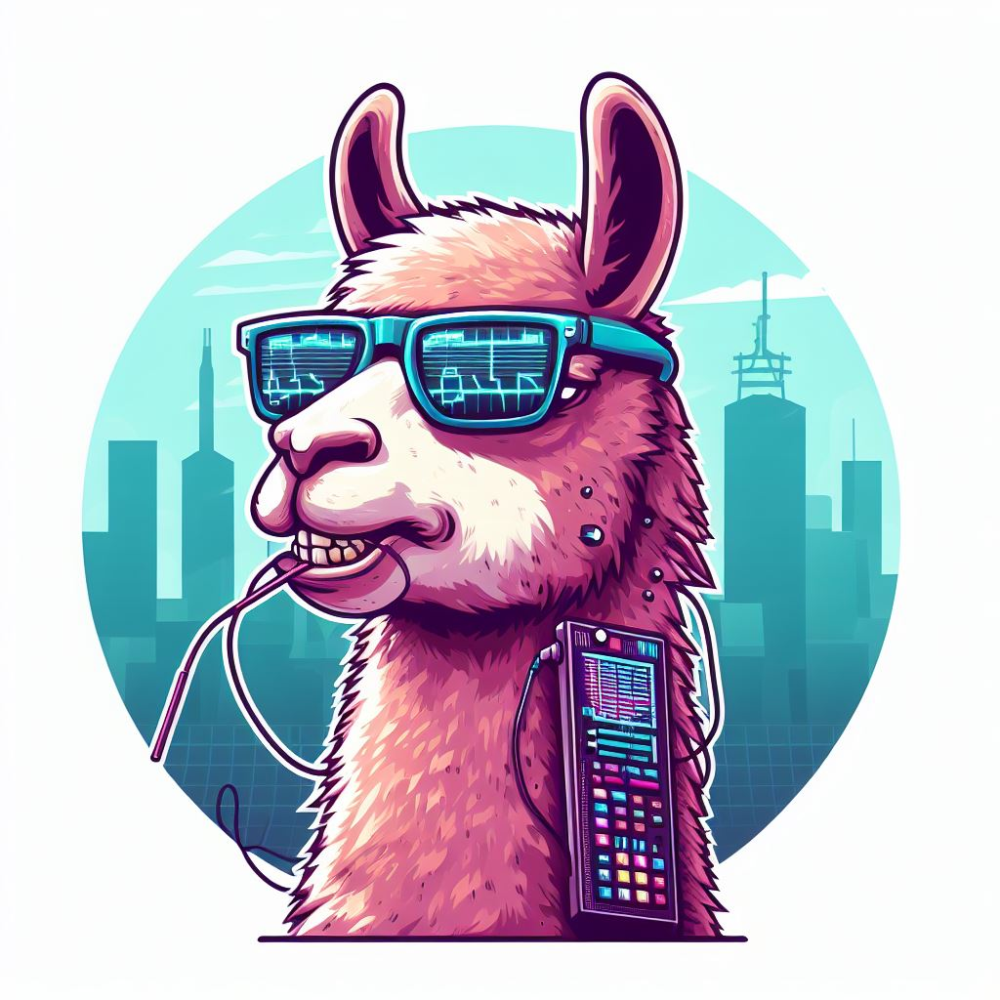

# Chatbot-LLama-Pruefungsamt





## Installation


### Prerequisites

- python wrapper for [LLama.cpp](https://github.com/ggerganov/llama.cpp): `pip install CMAKE_ARGS="-DGGML_CUDA=on" pip install --upgrade llama-cpp-python==0.2.84` (flags for non CUDA setups can be found in [their](https://github.com/abetlen/llama-cpp-python) installation instructions)
- our local rag lib: `pip install ./libs/custom_rag_loader/`
- (optionally jupyter and ipython notebooks)
- [Promptfoo](https://github.com/promptfoo/promptfoo) for llm_eval (we used version `0.54.1` if latest does not work): `npx promptfoo@latest` or `npm install -g promptfoo@latest`


### Install Python Dependencies

- `pip install -r requirements.txt`

There are separate `requirements.txt` for [Finetuning](./finetune/) and the [Prototype](./prototype/).
They can be optionally installed aswell with (or installed independently if only one of those topics is of interest)

`pip install -r ./finetune/requirements.txt` 

and

`pip install -r ./prototype/requirements.txt`


We recommend creating separate for finetuning and rag (e.g. llm_eval or running the prototype) to avoid version/dependency conflicts:

```
cd ~/environments

python3 -m venv <env-name>

source ~/environments/<env-name>/bin/activate
```


### Adding Models

- we hardcoded (sorry) the model paths and model_file_names in our [custom_rag_loader](libs/custom_rag_loader/custom_rag_loader.py)
- they need to be adjusted [here](libs/custom_rag_loader/custom_rag_loader.py?plain=1#L14-15) and [here](libs/custom_rag_loader/custom_rag_loader.py?plain=1#L103-128)