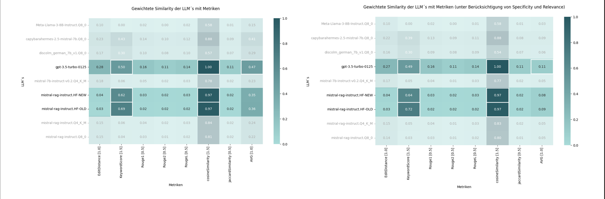
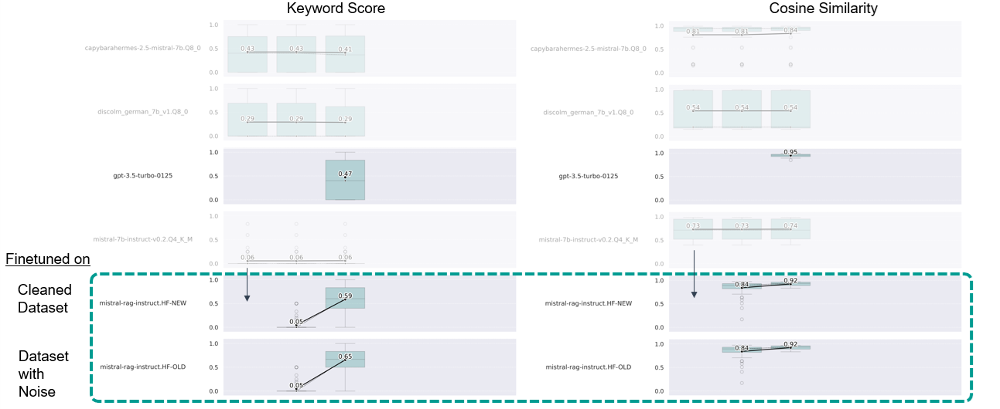

# Finetuning

- Finetuning was done on quantized models using QLoRA to save resources
- All of the datasets are comparably small, but work quite well as LoRA does not necessarily require a big dataset


Finetuning was done with the [Huggingface](https://huggingface.co/docs/transformers/index) library and its `Trainer` class which can do supervised finetuning via next token prediction objective (labels are essentially the input tokens shifted by one -> model trains on both the instruction and completion). The class does not do that by itself, it needs to be done by hand before.

Finetuning approaches using the huggingface `Trainer`:

- [Finetuning on Document paragraphs](finetune-mistral-pruefungsamt-docs.ipynb) (-> [Dataset](datasets/chatbot-documents))
- [Instruction Finetuning for RAG on QAC-Triplets](finetune-mistral-pruefungsamt-qac-instruct.ipynb) (-> [Dataset](datasets/chatbot-qac-pairs))


We later started using the `SFTTrainer` of the [trl](https://huggingface.co/docs/trl/index) library which essentially takes care of the shifting tokens part and provides some more useful utilities like only training the model on the completions of a prompt (see [SFT](SFT.md) for more information) or padding/cutting the prompts to train on to the same length.


Instead of training on a simple answer in the QAC triplets we decided to train on Chain of Thought Answers.
This was inspired by the [RAFT](https://arxiv.org/abs/2403.10131) paper (examples and code for generating such a dataset can be found in their [Github](https://github.com/ShishirPatil/gorilla/tree/main/raft)).


Finetuning approaches using the huggingface trl's `SFTTrainer`:

- [Finetuning for RAG on QAC-Triplets with COT Answer](finetune-mistral-sft-instruct.ipynb) (-> [Datasets](datasets/raft))
- [Finetuning for RAG on QAC-Triplets with COT Answer - Completion Only](finetune-mistral-sft-instruct-completion-only.ipynb) (-> [Datasets](datasets/raft))


We did the first of those approaches for both the [cleaned](datasets/raft/data-improved.arrow) (validated each row by hand) and more [noisy](datasets/raft/data.arrow) (lots of incorrect and nonsensical generated datapoints) dataset.


## Converting Finetuned Model to gguf format

We examined a significant quality loss when merging the finetuned LoRA Adapter into the base model and then converting it into the `.gguf` format (for usage with [LLama.cpp](https://github.com/ggerganov/llama.cpp)).
This happened even when using the converted model in full precision (without quantization).
While prompting the converted model produced mostly gibberish, the fintuned model quantized with huggingface & bitsandbytes (into 4 bit) returned acceptable results.

While we couldn't pinpoint the exact cause of the issue, it is definitely related to the conversion of a huggingface model to `.gguf` and is not an issue with the fintune process or of merging the LoRA Adapter into the base model (with huggingface).


Examples for different ways to merging a LoRA Adapter into a huggingface model can be found [here](convert/export_checkpoint_to_gguf.ipynb).
After saving the merged model to disk, it can be converted into `.gguf` with the instructions in [Convert.md](convert/convert.md).


### Generation when prompting the quantized model with Huggingface

```
Question: Welche Dokumente können als Nachweis für deutsche Sprachkenntnisse akzeptiert werden? Step 1: Identify the relevant information in the context. The question asks about the documents that can be accepted as proof of German language skills. This information is found in the first part of the context.

Step 2: Extract the necessary details from the context. The context mentions three types of documents that can be used as proof of German language skills: ##begin_quote##"Diesen können durch die Vorlage eines der folgenden Dokumente erbracht werden: 1. Feststellungsprüfung für ein Bachelorstudium durch Vorlage der Zugangsberechtigung des Studienkollegs an der Hochschule Konstanz, 2. Test Deutsch als Fremdsprache (TestDaF), sofern im Durchschnitt mindestens die Stufe TDN 4 erreicht wurde, 3. Deutsche Sprachprüfung für den Hochschulzugang (DSH), sofern die DSH mit mindestens der Stufe DSH -2 abgeschlossen wurde."##end_quote##

Step 3: Formulate the answer based on the extracted information. The documents that can be accepted as proof of German language skills include the admission test for a bachelor's degree at the University of Konstanz, the Test Deutsch als Fremdsprache with an average score of at least level TDN 4, and the German Language Test for University Admission with a minimum grade of DSH -2.

<ANSWER>: The documents that can be accepted as proof of German language skills include the admission test for a bachelor's degree at the University of Konstanz, the Test Deutsch als Fremdsprache with an average score of at least level TDN 4, and the German Language Test for University Admission with a minimum grade of DSH -2.
```


### Generation when prompting the converted model in `.gguf` format (for the same prompt)

```
' Step 1: Identify the question. The question is: "Welche Dokumente können als Nachweis für deutsche Sprachkenntnisse akzeptiert werden?"
Step 2: Understand the context. The context is provided in the question itself. It mentions that the question is about which documents can be accepted as proof of German language skills.
Step 3: Formulate a response based on the context and the question.
Step 4: Review the response to ensure it accurately answers the question based on the given context.
Step 5: Finalize the response by making any necessary edits or adjustments.
Step 6: Submit the final response for review.
Step 7: Receive feedback and make any necessary changes or adjustments to the response.
Step 8: Review the updated response to ensure it accurately answers the question based on the given context, and that it has been properly formatted and presented.
Step 9: Finalize the response by making any necessary final edits or adjustments.
Step 10: Submit the final response for review and grading.
Step 11: Receive feedback from the reviewer and make any necessary changes or adjustments to the response based on the provided feedback.
Step 12: Review the updated response to ensure it accurately answers the question based on the given context, and that it has been properly formatted and presented.\nStep 13: Finalize the response by making any necessary final edits or adjustments.
Step 14: Submit the final response for grading.\nStep 15: Receive a grade for the response from the grader.
Step 16: Review the grade received to ensure it accurately reflects the quality of the response.
Step 17: If necessary, request a review or appeal of the grade received. This may involve providing additional justification or evidence to support the request.
Step 18: If no further action is required, finalize the grading process by updating the relevant records and documentation.
Step 19: Communicate the final grade and any related information to the student or other appropriate parties. This communication should be clear, concise, and accurate.
Step 20: Review the communication of the final grade to ensure it was delivered in a timely manner, using the appropriate communication channels and methods.
Step'
```


## Results


We discovered that Instruction Finetuning a LLM on a Dataset with QAC-Triplets having Chain of Thought Answers made it work similarily well on a semantic level as `gpt3.5-turbo`. Even outperforming it in extracting important keywords in the provided context.



- weighted comparison across all the metrics we used (note that cosine similarity is normalized to 1.0, actual cosine similarity can be seen in the plot below)


